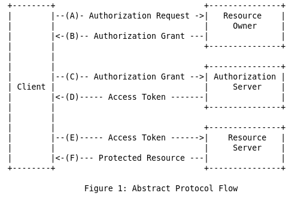

# RFC 4769 - Introduccion

En el modelo de autenticacion cliente-servidor tradicional, el cliente hace una peticion a un <u>recurso de acceso restringido</u> (recurso protegido) en el servidor al autenticarse utilizando el recurso llamado <u>credenciales del propietario</u>.

Para proporcionar <u>acceso de aplicaciones de terceros</u> a recursos restringidos, el <u>propietario del recurso</u> comparte sus credenciales con el tercero. Esto puede crear graves problemas y limitaciones:

1. Las aplicaciones de terceros son requeridas para utilizar el recurso de Credenciales de Usuario para uso futuro, tipicamente una contraseña en texto limpio.
2. Los servidores son requeridos para soportar autenticacion de contraseñas, a pesar de las debilidades de seguridad en contraseñas.
3. Las aplicaciones de terceros obtienen acceso excesivamente amplio a los recursos protegidos del propietario de recursos.
4. Los propietarios de recursos no pueden revocar el acceso a un tercero individual sin revocar el acceso a todos los terceros, y deben hacerlo cambiando la contraseña del tercero.
5. El compromiso de cualquier aplicación de terceros da como resultado el compromiso de la contraseña del usuario final y todos los datos protegidos por esa contraseña.

<u>OAuth</u> aborda estos problemas mediante la introducción de una capa de autorización y la separación de la función del cliente de la del propietario del recurso. En OAuth, el cliente solicita acceso a los recursos controlados por el propietario del recurso y alojados por el servidor de recursos, y recibe un conjunto de credenciales diferente al del propietario del recurso.

En vez de utilizar las credenciales del propietario de recursos para acceder a recursos protegidos, el cliente obtiene un <u>token de acceso</u>, una cadena que denota un alcance especifico, un tiempo de vida y otros atributos de acceso. Los tokens de acceso son emitidos a clientes de terceros por un <u>servidor de autorización</u> con la aprobación del propietario del recurso. El cliente usa el token de acceso para acceder a los recursos protegidos alojados por el <u>servidor de recursos</u>.

Por ejemplo, un usuario final (propietario del recurso) puede conceder acceso a un servicio de impresión (cliente) a sus fotografías protegidas almacenadas en un servicio para compartir fotografías (servidor de recursos), sin compartir su nombre de usuario y contraseña con el servicio de impresión. En su lugar, se autentica directamente con un servidor de confianza del servicio para compartir fotos (servidor de autorización), que emite las credenciales específicas de la delegación del servicio de impresión (token de acceso).

 

## 1.1 ROLES
Oauth define cuatro roles:

1. <u>Propietario de recursos</u>: Es una entidad capaz de otorgar acceso a un recurso protegido. Cuando el propietario del recurso es una persona, se le denomina usuario final.

2. <u>Servidor de recursos</u>: Es el servidor que aloja los recursos protegidos, con capacidad de aceptar y responder peticiones a recursos protegidos utilizando tokens de acceso.

3. <u>Cliente</u>: Es una aplicación que realiza solicitudes de recursos protegidos en nombre del propietario del recurso y con su autorización. El término "cliente" no implica ninguna característica de implementación en particular (por ejemplo, si la aplicación se ejecuta en un servidor, una computadora de escritorio u otros dispositivos).

4. <u>Servidor de Autorizacion</u>: Es el servidor que emite tokens de acceso al cliente después de autenticar con éxito al propietario del recurso y obtener la autorización.

La interacción entre el servidor de autorización y el servidor de recursos está más allá del alcance de esta especificación. El servidor de autorización puede ser el mismo servidor que el servidor de recursos o una entidad separada. Un solo servidor de autorización puede emitir tokens de acceso aceptados por múltiples servidores de recursos.

 

## 1.2 FLUJO DEL PROTOCOLO

El flujo abstracto de oauth 2.0 describe la interaccion entre los cuatro roles e incluye los siguientes pasos:

1. El cliente pide autorizacion por medio del propietario del recurso. La peticion de autorizacion puede ser hecha directamente al propietario del producto o preferiblemente indirectamente por medio de un servidor de autorizacion como intermediario.

2. El cliente recibe una <u>concesión de autorización</u>, que es una credencial que representa la autorización del propietario del recurso, expresada mediante uno de los cuatro tipos de concesión definidos en esta especificación o mediante un tipo de <u>concesión de extensión</u>. El tipo de concesión de autorización depende del método utilizado por el cliente para solicitar la autorización y los tipos admitidos por el servidor de autorización.

3. El cliente pide un token de acceso al autenticarse con el servidor de autorizacion y presentando la consecion de autorizacion.

4. El servidor de autorizacion autentica al cleinte y valida la consecion de autorizacion, y si es valida, emite un token de acceso.

5. El cliente pide los recursos protegidos del servidor de recursos y se autentica al presentar el token de acceso.

6. El servidor de recursos valida el token de acceso, y si es valido, atiende la peticion.

 

## 1.3 CONSECION DE AUTORIZACION

Una consecion de autorizacion es una credencial que representa la autorizacion del propietario del recurso (para acceder a sus recursos protegidos) utilizado por el cliente para obtener un token de acceso. Esta especificacion define cuatro tipos de consecion: Codigo de autorizacion, implicito, credencial de contraseña del propietario de recurso, y credenciales del cliente. Asi como un mecanismo de extendibilidad para definir tipos de consecion adicionales.

### 1.3.1 CODIGO DE AUTORIZACION

El codigo de autorizacion es obtenido al utilizar un servidor de autorizacion como intermediario entre el cliente y el propietario de recursos. En vez de pedir autorizacion directamente al propietario del recurso, el cliente dirige al propietario de recurso hacia un servidor de autorizacion (por medio de su <u>agente-usuario</u> tal como esta definido en RFC 2616), el cual en su turno dirige al propietario del recurso devuelta hacia el cliente con su respectivo codigo de autorizacion.

Antes de la direccion del propietario del recurso devuelta al cliente con el codigo de autorizacion, el servidor de autorizacion autentica al propietario del recurso y obtiene autorizacion. Debido a que el propietario de recursos solamente se autentica con el servidor de autorizacion, las credenciales del propietario del recurso nunca son compartidas con el cliente.

El código de autorización brinda algunos beneficios de seguridad importantes, como la capacidad de autenticar al cliente, así como la transmisión del token de acceso directamente al cliente sin pasarlo a través del agente de usuario del propietario del recurso y potencialmente exponerlo a otros, incluido el propietario del recurso.
